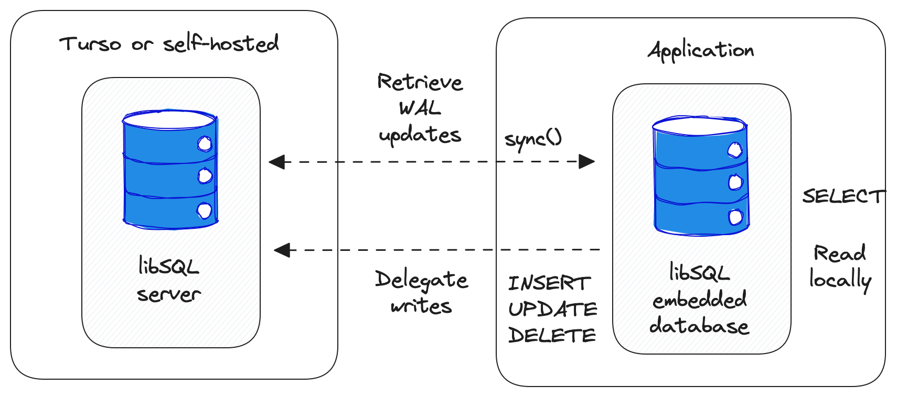
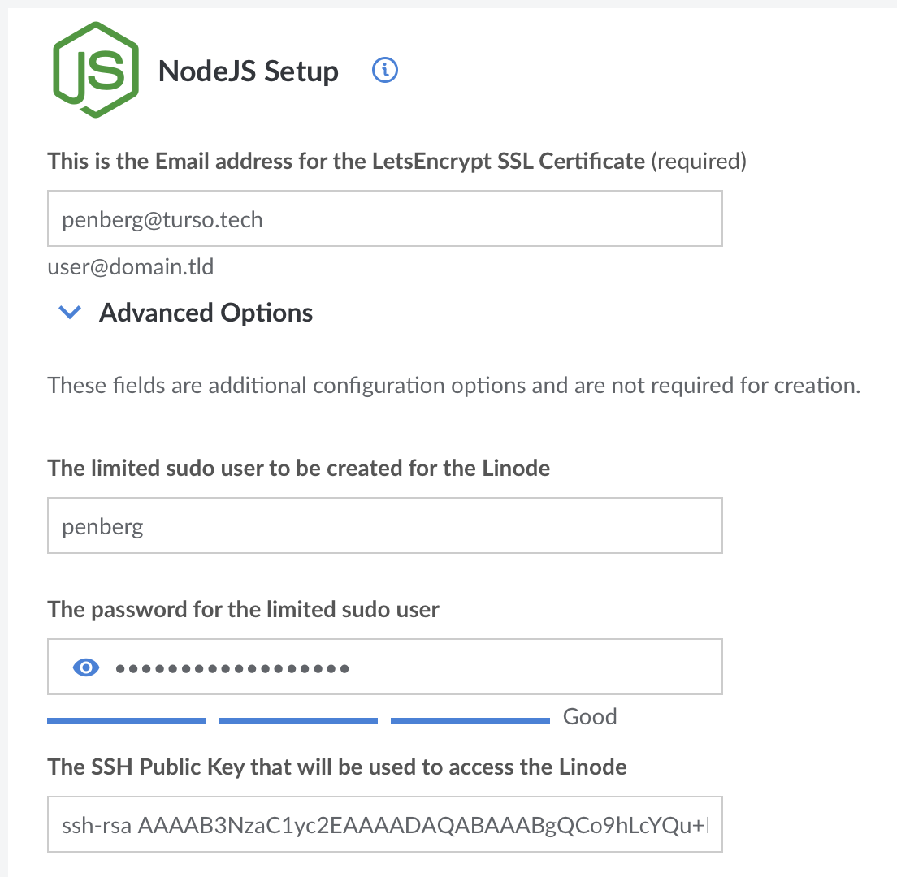

# Linode + Node.js + Turso Example

## Overview

This repository contains integration guide and example source code for running a Node.js app with Turso on Linode.



## Setup

First, create a database on Turso:

```console
turso db create linode-example
```

Then create the schema and insert some data for this example application:

```
turso db shell linode-example
```

```sql
CREATE TABLE leaderboard (id INT PRIMARY KEY, player TEXT, score INT, matches INT);

INSERT INTO leaderboard VALUES (1, 'Alice', 100, 10);
INSERT INTO leaderboard VALUES (2, 'Bob', 50, 10);
INSERT INTO leaderboard VALUES (3, 'Carol', 1, 1);
```

### Deploy Linode

First, deploy a Linode [Node.js app](https://www.linode.com/marketplace/apps/linode/nodejs/) via the Linode Marketplace.

You will see a setup screen that looks like this:



You need to configure the following:

* Email address for SSL certificate
* Limited `sudo` username and password
* Your public SSH key (in `~/.ssh/id_rsa.pub` typically)
* Region
* Plan
* Root password

For other settings, just leave to whatever defaults they are.

When the Linode is up and running, you can now use `ssh` to access the machine.
You can find the username and IP address in `SSH Access` section of your Linode dashboard.

### Deploy app

First, upload source code to the machine:

```
scp -r linode <user>@<host>:.
```

Then, configure database access control settings:

```console
export TURSO_URL=$(turso db show linode-example --url)
export TURSO_AUTH_TOKEN=$(turso db tokens create linode-example)

echo "TURSO_URL = $TURSO_URL" > .env
echo "TURSO_AUTH_TOKEN = $TURSO_AUTH_TOKEN" >> .env
```

and upload the `.env` file to the server:

```
scp .env <user>@<host>:linode
```

Then connect to the server:

```
ssh -A <user>@<host>
```

Stop the hello world application running there:

```
sudo pm2 stop hello
```

```
[PM2] Applying action stopProcessId on app [hello](ids: [ 0 ])
[PM2] [hello](0) ✓
┌────┬──────────┬─────────────┬─────────┬─────────┬──────────┬────────┬──────┬───────────┬──────────┬──────────┬──────────┬──────────┐
│ id │ name     │ namespace   │ version │ mode    │ pid      │ uptime │ ↺    │ status    │ cpu      │ mem      │ user     │ watching │
├────┼──────────┼─────────────┼─────────┼─────────┼──────────┼────────┼──────┼───────────┼──────────┼──────────┼──────────┼──────────┤
│ 0  │ hello    │ default     │ N/A     │ fork    │ 0        │ 0      │ 0    │ stopped   │ 0%       │ 0b       │ root     │ disabled │
└────┴──────────┴─────────────┴─────────┴─────────┴──────────┴────────┴──────┴───────────┴──────────┴──────────┴──────────┴──────────┘
```

Setup and start our application:

```
cd linode
npm i
node index.js
```

and now you can access the endpoint with the reverse DNS name that you will find under the network tab.
For example, if your IP address is `172.232.134.53`, then the reverse IP address is `172-232-134-53.ip.linodeusercontent.com`.

```
curl -s https://<reverse DNS address> | jq
```

```
[
  {
    "rank": 1,
    "player": "Alice",
    "score": 100
  },
  {
    "rank": 2,
    "player": "Bob",
    "score": 50
  },
  {
    "rank": 3,
    "player": "Carol",
    "score": 1
  }
]
```
